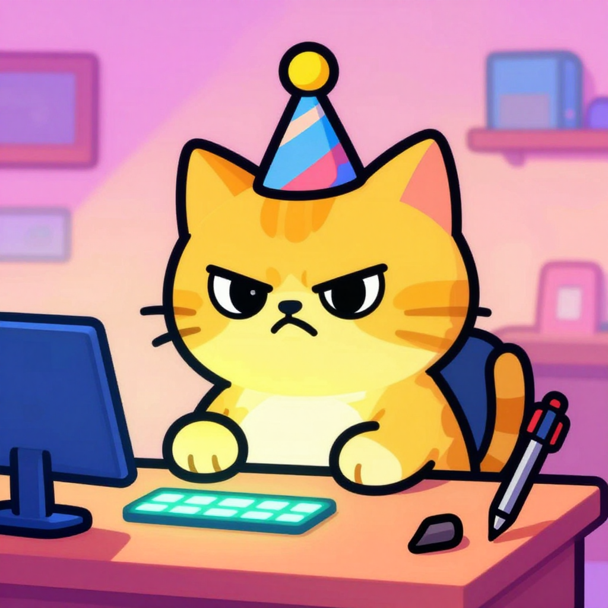
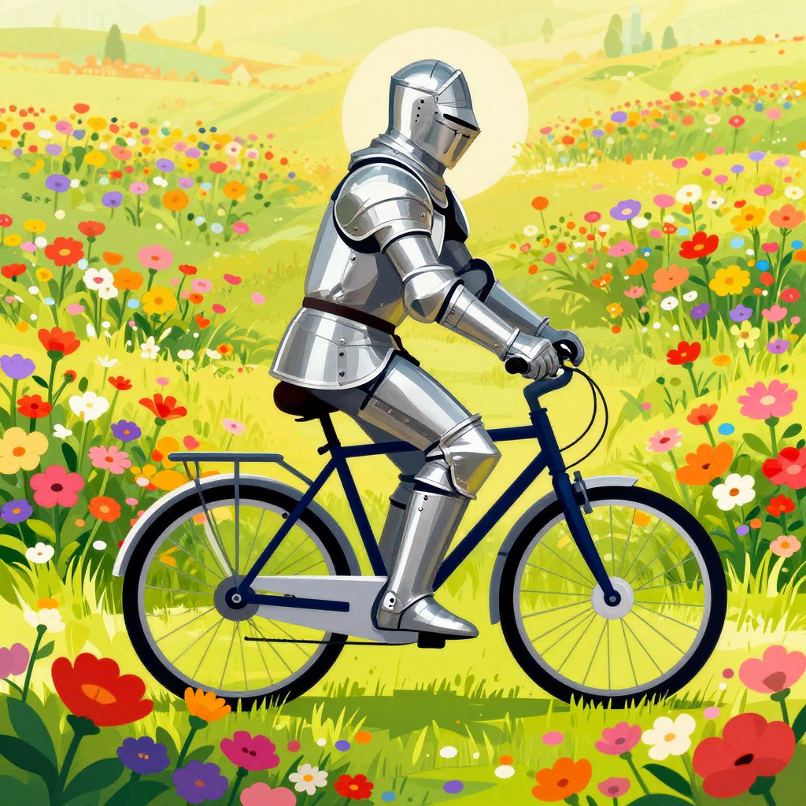
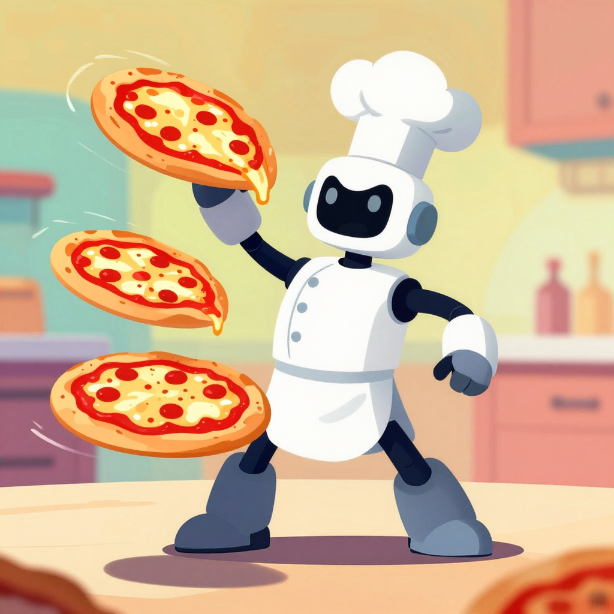

# Cartoon Universe: A Cognitive Environment for Consistent Cartoon Styling

This cognitive environment is designed to enforce a specific, consistent cartoon aesthetic across a wide variety of generated subjects. Unlike simple prompt-based styling, this environment encodes a robust visual grammar, ensuring that every output adheres to the defined "Cartoon Universe" style, regardless of the subject matter (human, animal, object, scene).

## Purpose

-   **Unwavering Style Consistency:** Generate images that always look like they belong to the same cartoon universe, preventing stylistic drift.
-   **Visual Grammar Enforcement:** Encode explicit rules for line art, color, shading, proportions, and perspective.
-   **Effortless Styling:** Users can focus on describing the subject ("Subject: penguin holding a pen"), with the style automatically and implicitly applied and enforced.
-   **Developer & Artist Aid:** Provide a reliable tool for prototyping cartoon assets, storyboard elements, or consistent placeholder graphics.

## Architecture

This environment operates as a "style engine," leveraging a latent-aware architecture to strategically influence diffusion models (the image generation model) for cartoon-specific outputs. It focuses on:

1.  **Core Visual Grammar:** Defining foundational rules that must never change (e.g., line thickness, color bounds).
2.  **Latent Amplification:** Enhancing tokens for specific cartoon traits (e.g., cel-shading, exaggerated features).
3.  **Negative Conditioning:** Crucially, systematically suppressing realism traits and undesirable inconsistencies.
4.  **Style Enhancement:** Applying a footer of high-impact cartoon-specific tokens to every generated prompt.
5.  **Optimized Prompt Ordering:** Structuring the prompt to prioritize latent-dominant style signals.

By processing concise subject descriptions through this structured knowledge base, INTENTIO can produce visually cohesive and brand-aligned cartoon imagery, eliminating the need to repeatedly describe the style in prompts. You are not prompting a style; you are running a style engine.

## Quick Start Example Prompts

To experience the consistent "Cartoon Universe" style across different subjects, try these example prompts. INTENTIO will automatically apply the visual grammar and stylistic rules.

1.  A cheerful astronaut floating in space, waving.

    
---
2.  A grumpy cat wearing a tiny party hat, sitting at a desk.

    
---
3.  A medieval knight riding a bicycle through a field of flowers.

    
---
4.  A wise old owl reading a very large book in a cozy armchair.

    
---
5.  A futuristic robot chef juggling pizzas in a brightly lit kitchen.

    