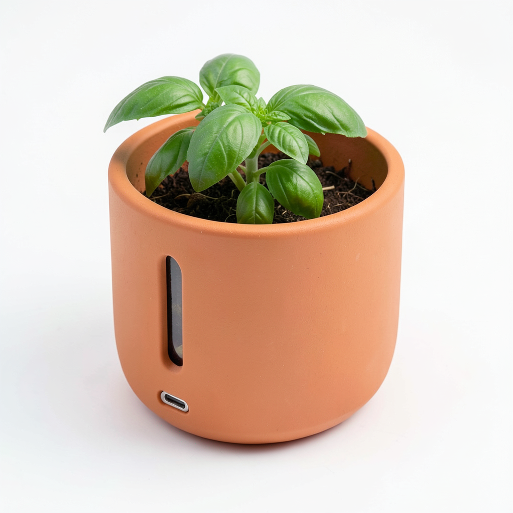
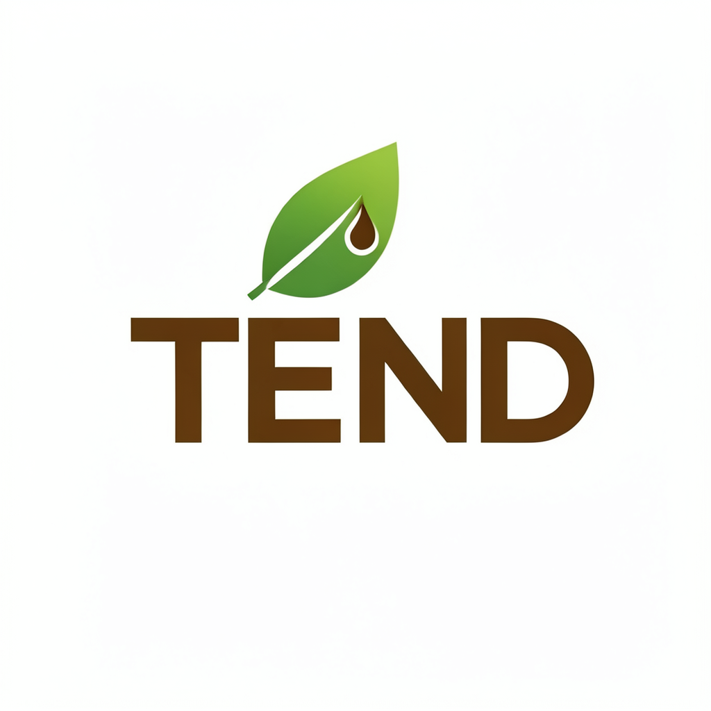
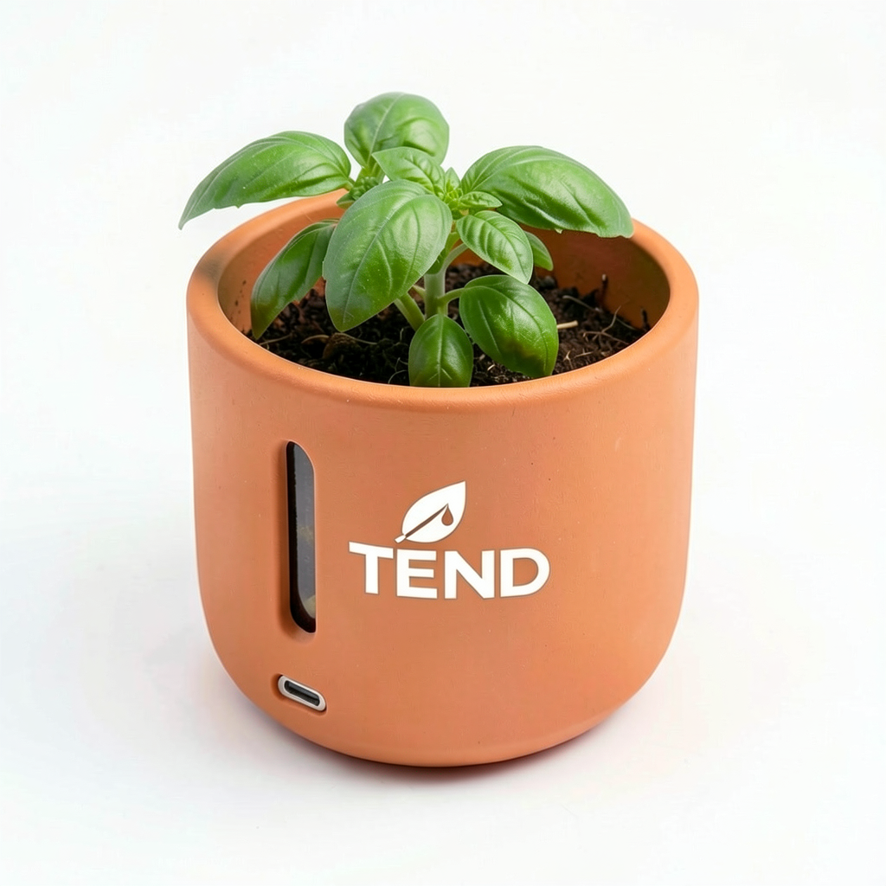
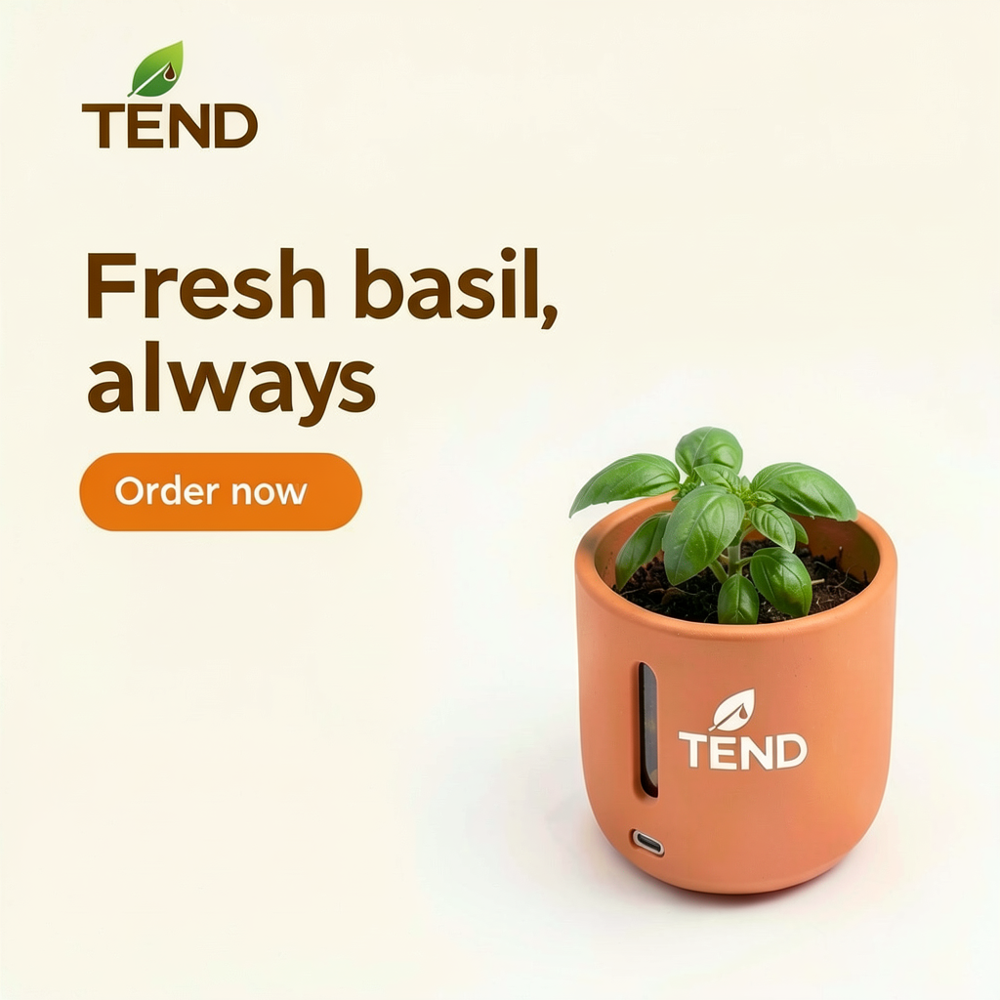

# Product Pitch Lab Package

A cognitive instrument for validating, refining, and visualizing product ideas, grounded in a small knowledge base of business frameworks and visual design principles.

This package operates as a suite of "commands" that you run from the INTENTIO interactive mode. Five of them reason in text; four of them write a prompt for the local image model and render it. A logo and a product image you keep are used again by the later image commands. It is designed for founders, product managers, and students who want to stress-test an idea before investing in it.

## From an Idea to a Landing Page

One idea, taken through the package: a self-watering pot for kitchen herbs. Each image was rendered locally from a prompt the package wrote.

| The product | The logo |
| :---: | :---: |
|  |  |
| `visualize_product` | `logo_concept` |
| **The logo on the product** | **The landing page** |
|  |  |
| `brand_product` | `landing_page` |

The last two images are not drawn from words alone. They reuse the first two, which is why the pot and the logo stay the same across them. The steps are in [Example Usage](#example-usage).

## Quick Start

```bash
./intentio init product_pitch_lab --space=product_pitch_lab
./intentio interact
```

Select the `product_pitch_lab` space. The first time you enter it, INTENTIO ingests the knowledge base, then starts you on `validate_idea`.

## How It Works

Every command is a prompt template. When you select one, you are given a specific instruction for what to enter. The system then builds its answer from two sources of context:

*   **Pinned knowledge**: each analysis command names the knowledge files it depends on, and INTENTIO loads those files in full.
*   **Retrieved knowledge**: the passages of the knowledge base most similar to your input.

After each answer you choose the command for your next step, so a session naturally moves from validation to refinement to visualization.

## Available Commands (Prompts)

### Analysis Commands (Text)

*   **`validate_idea`** (Default)
    *   Critically evaluates a product idea: problem clarity, target customer, solution viability, the red flags that apply, the riskiest assumptions, and a verdict.
    *   Grounded in `problem_solution_fit.md` and `red_flags.md`.
    *   *Instruction: Describe your product idea in 2-3 sentences (what it is, who it is for, what problem it solves):*

*   **`craft_pitch`**
    *   Writes a 30-45 second elevator pitch in five parts: hook, problem, solution, unique value, call to action.
    *   Grounded in `elevator_pitch.md`.
    *   *Instruction: Enter your product name, what it does, and who it is for:*

*   **`competitor_analysis`**
    *   Maps the alternatives you describe, compares them with SWOT and a Jobs-to-be-Done table, and recommends a differentiation strategy.
    *   Grounded in `competitive_analysis.md`.
    *   *Instruction: Describe your product and 2-3 competitors or alternatives, with what you know about each:*

*   **`business_model`**
    *   Drafts a nine-block Lean Canvas, marks every entry as stated or assumed, and names the riskiest assumptions to test.
    *   Grounded in `lean_canvas.md` and `value_proposition.md`.
    *   *Instruction: Describe your product concept and its target market:*

*   **`default`**
    *   Answers open questions about the frameworks in the knowledge base (e.g., "What is the difference between a vitamin and a painkiller?").
    *   *Instruction: Ask a question about product strategy or business frameworks:*

### Visualization Commands (Image Generation)

*   **`visualize_product`**
    *   Designs the object from a plain description (size, shape, materials, one key feature), writes a product photography prompt for it, then offers to render it.
    *   Grounded in `product_mockup.md`.
    *   *Instruction: Describe your product and what it does (e.g., 'a lunch box that heats a meal' or 'a pen for architects with a scale ruler in the barrel'):*

*   **`logo_concept`**
    *   Turns a brand brief into a logo prompt (type, colors, shape, typography), then offers to render it.
    *   Grounded in `logo_design.md`.
    *   *Instruction: Describe your brand briefly (e.g., 'Vortex, urban backpacks, bold and modern'):*

*   **`brand_product`**
    *   Prints the logo on the product. It needs a kept `product` and a kept `logo`.
    *   *Instruction: Say where the logo goes on the product, how large, and in which color (e.g., 'small, in white, on the front of the lid'):*

*   **`landing_page`**
    *   Designs the first screen of a landing page (the logo, a headline of at most five words, one button, the product photograph), then offers to render it. It needs a kept `product` and a kept `logo`, and places both on the page.
    *   Grounded in `landing_page.md`.
    *   *Instruction: Enter your product name, what it does for its user, and how it looks (e.g., 'Lumo, a reading lamp that clips to a book so you can read in bed without waking anyone. A slim white aluminium arm with a warm light.'):*

## Example Usage

The example follows one idea through the package: **Tend**, a self-watering pot for kitchen herbs. Every answer and image below came from the default models (Mistral 7B and FLUX.2 klein) on a laptop.

### Phase 1: Validation

```
(Active Prompt Template: validate_idea)
Instruction: "Describe your product idea in 2-3 sentences (what it is, who it is for, what problem it solves):"

[validate_idea] > A self-watering plant pot for people who love fresh herbs in the kitchen but forget to water them. A hidden water tank keeps a herb plant alive for three weeks, and a window on the side shows when to refill.
```

The system answers with a structured critique. It names the red flags that apply and ends with a verdict: **Promising**, **Needs rework**, or **Fatal flaw**. For Tend it ended like this:

```
#### 4. Red Flags
- Solution looking for a problem: It's not clear if the problem of forgetting to water plants is widespread.
- Solving only part of a workflow: Users might still need to replenish the herbs when they run out.

#### Verdict
**Needs rework**: [...] It's essential to validate that the problem is widespread and that the product addresses the entire workflow before moving forward.
```

### Phase 2: Refinement

A command stays active until you change it. Type `switch_prompt` and choose `craft_pitch`, `competitor_analysis`, or `business_model`:

```
[validate_idea] > switch_prompt

Available Prompt Templates for 'product_pitch_lab':
  1. brand_product
  2. business_model
  3. competitor_analysis
  4. craft_pitch
  5. default
  6. landing_page
  7. logo_concept
  8. validate_idea
  9. visualize_product
Enter the number of the prompt template to use: 4

[craft_pitch] > Tend, a self-watering plant pot that keeps a kitchen herb alive for three weeks without watering, for home cooks who forget to water their plants.
```

### Phase 3: Visualization

Type `switch_prompt`, choose `visualize_product`, and describe the product:

```
[visualize_product] > Tend, a self-watering plant pot that keeps a kitchen herb alive for three weeks. Matte terracotta orange ceramic, with a narrow clear window on its side that shows the water level. A basil plant grows in it.
```

The system will:
1. Work out the product's size and shape from what it does, using the design principles in the knowledge base
2. Write an image prompt wrapped in `<<<RENDER_PROMPT>>>` tags
3. Ask: `Render this image? (yes/no):`
4. On `yes`, generate the image with the local image model
5. Save it to `spaces/<your_space>/renderer_images/`


`logo_concept` works the same way, from a short brand brief:

```
[logo_concept] > Tend, self-watering plant pots for kitchen herbs, warm and natural
```


Not happy with a result? Answer `no`, or render again: each render starts from a different random seed, so the same prompt gives a different image.

Lettering is where a small image model fails most often. Render a logo or a landing page more than once and check the spelling.

### Phase 4: One Product Across the Images

After a render from `visualize_product` or `logo_concept`, the system asks one more question:

```
Keep this image as the 'logo' of this space, for later renders? (yes/no):
```

On `yes`, the image is copied to `renderer_images/kept/logo.png`. The space holds one kept `product` and one kept `logo`; keeping a new one replaces the copy, and every render stays in `renderer_images/`.

The two commands that follow are shown the kept images, so they draw your product and your logo, not new ones.

`brand_product` prints the logo on the product:

```
[brand_product] > medium, in white, on the front of the pot
```


Keep the result as the `product` if you want the page to show it. `landing_page` then places the logo at the top of the page and the product in its photograph, and writes the headline and the button itself:

```
[landing_page] > Tend, a self-watering plant pot that waters your kitchen herbs for three weeks, so you always have fresh basil. A round matte terracotta orange ceramic pot with a basil plant.
```

```
**Headline**: Fresh basil, always
**Button**: Order now
**Page**: On the right, warm off-white background, orange button
```


This is the best of four renders: the other three misspelled a word or added a scribbled menu. A headline of short, common words is drawn right far more often than a long one.

Without a kept `product` and a kept `logo`, these two commands refuse and name the command that makes the missing image. A render from kept images takes a few times longer than one from text alone.

## Notes

*   **The session has no memory of text between commands.** Each command sees only what you type into it, so repeat the product description when you move from one phase to the next. Only the images you keep are carried over.
*   **Images are saved in the space, not in this package.** The `renderer_images/` folder is created on the first render.
*   **Changing the knowledge.** A space is a copy of this package. To change what the space knows, edit the files under `spaces/<your_space>/knowledge/`, then run `./intentio ingest --space=<your_space>`. Only the files you changed are re-indexed.
*   **Context window.** `validate_idea` and `business_model` each load two knowledge files in full. If answers seem to ignore the frameworks, the prompt is probably larger than your model's context window. INTENTIO prints a warning when it estimates so; about 8,000 tokens are enough for this package.

## What This Package Is

✅ A validation tool for stress-testing product ideas  
✅ A structured way to draft a pitch, a competitive analysis, and a Lean Canvas  
✅ A concept visualizer for early mockups, logo directions and landing pages  
✅ A compact reference on business frameworks  

## What This Package Is Not

❌ A substitute for market research or customer interviews  
❌ A source of market data (it has none, and is told not to invent any)  
❌ A production-ready design tool  
❌ A guarantee of product success  

The mockups are concept sketches, not final designs. The analysis applies established frameworks to what you tell it; it knows nothing about your market that you have not written down.
